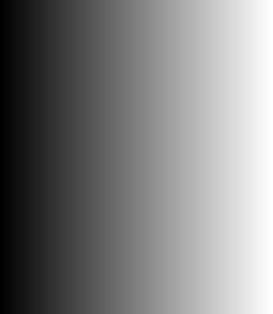
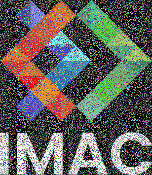
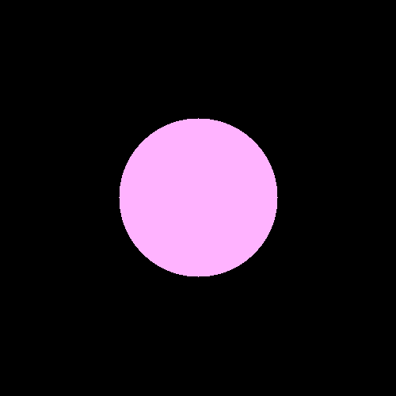
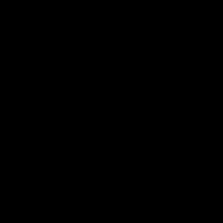
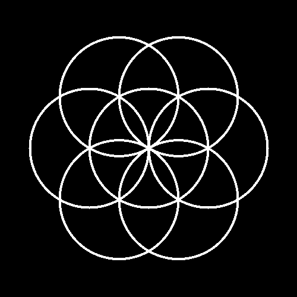
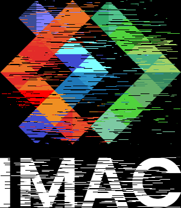
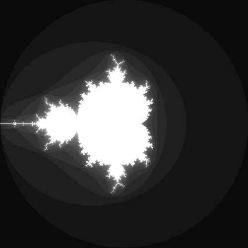

# S1 | Prog: Workshop

## ⭐ Ne garder que le vert

rouge et bleu à zéro

## ⭐ Échanger les canaux

## ⭐ Noir & Blanc

## ⭐ Négatif

1 - la couleur

## ⭐ Dégradé

## ⭐ Miroir

## ⭐⭐ Image bruitée

<!-- sans le if (true_with_probability(0.1f)) chance de 10%
j'avais du bruit partout j'ai du comprendre comment ajouter de la probabilité (merci la lib) -->

## ⭐ Rotation de 90°

## ⭐⭐ Split RGB

## ⭐⭐ Luminosité

## ⭐⭐(⭐) Disque

ajouter if disque < rayon pour contenir le disque

## ⭐ Cercle

<!-- thickness = encadré le disque pour permettre l'épaisseur à la foir interieur et exterieur. (premier prboleme, epaisseur que interieur) -->

## ⭐⭐ Animation

<!--
ajout frame (-50) pour le que cercle arrive et loop parfaite
boucle for pour render  Accéléré sur le logiciel-->

## ⭐⭐⭐ Rosace

## ⭐⭐ Mosaïque

## ⭐⭐⭐ Glitch

## ⭐⭐⭐ Tri de pixels

## ⭐⭐⭐(⭐) Fractale de Mandelbrot

